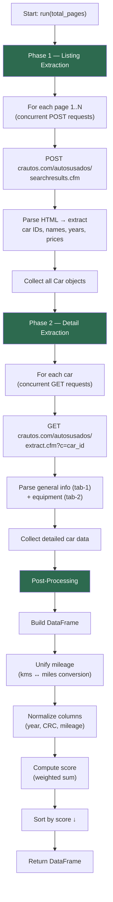

# crautos-scraper

[](https://github.com/miltonials/crautos-scrapper/releases/latest/download/crautos_dataset.csv)

Async Python scraper for extracting structured data about used cars in **Costa Rica** from **crautos.com**.

This project collects listings from the public catalog and extracts structured vehicle information that can be exported to **CSV or pandas DataFrames** for analysis.

The scraper is designed with **asynchronous networking**, **rate limiting**, and **data cleaning utilities**.

---

# Legal and Ethical Disclaimer

This project was created **strictly for educational and research purposes**.

- It is **not intended for denial-of-service attacks (DDoS)** or server overload.
- The author is **not responsible for misuse** of this software.
- Users must respect the **Terms of Service of the target website**.
- **Commercial use of this code or extracted data is prohibited.**

When using this scraper, please apply **reasonable rate limits**.

---

# Features

## Asynchronous Scraping

Uses:

- `asyncio`
- `httpx`

to perform concurrent HTTP requests, significantly reducing scraping time.

---

## Structured Data Extraction

Extracts information such as:

- car name
- model year
- price in colones
- price in dollars
- vehicle specifications
- equipment

---

## Automatic Data Cleaning

The scraper converts textual numeric fields into numeric values.

Example:

```text
"91,500 kms" → 91500
```

---

## HTML Parsing

Uses **BeautifulSoup** to extract structured information from the vehicle detail pages.

---

## Progress Monitoring

Interactive progress bars using:

```text
tqdm
```

---

## Data Export

The final result is returned as a **pandas DataFrame**, allowing easy export to:

- CSV
- Excel
- data analysis pipelines

---

# Installation

Clone the repository:

```bash
git clone https://github.com/miltonials/crautos-scraper.git
cd crautos-scraper
```

Install dependencies:

```bash
pip install -e .
```

For development (includes ruff, pytest, pre-commit):

```bash
pip install -e ".[dev]"
pre-commit install
```

Requirements:

```text
Python >= 3.10
```

---

# Project Architecture

The scraper is organized around two main components.

## 1. Data Model

A dataclass represents each car listing.

```python
@dataclass
class Car:
    id: str
    link: str
    name: str
    year: int
    CRC: Optional[float]
    USD: Optional[float]
```

This structure stores the **base information extracted from search pages**.

---

## 2. Scraper Engine

The main logic is organized as a Python package:

```text
src/crautos_scrapper/
├── __init__.py    # Public API
├── models.py      # Car dataclass
├── scraper.py     # CrAutosScraper class
└── __main__.py    # CLI entry point
```

Responsibilities include:

- concurrent request management
- parsing listing pages
- parsing detail pages
- data cleaning
- dataset assembly

---

# Scraping Workflow

The extraction process runs in **two phases**, followed by post-processing.



---

## Phase 1 — Listing Extraction

For each search results page:

1. Send POST request to:

```text
https://crautos.com/autosusados/searchresults.cfm
```

1. Extract car IDs and basic information.

Output example:

```text
id
name
year
price
link
```

---

## Phase 2 — Detail Extraction

For each car found:

1. Request:

```text
https://crautos.com/autosusados/extract.cfm?c=<car_id>
```

1. Extract detailed specifications such as:

- mileage
- engine
- transmission
- fuel type
- equipment
- notes

---

# Dataset Fields

Typical dataset columns include:

```text
id
link
name
score
year
year_normalized
CRC
CRC_normalized
USD
Kilometraje (kms)
Kilometraje (kms)_normalized
motor
transmisión
combustible
equipamiento
notas
```

Note: Some fields may vary depending on the vehicle listing.

---

# Vehicle Scoring

Each listing receives a **score** based on a weighted combination of normalized values:

```text
score = year_normalized × 1 + CRC_normalized × (−1) + mileage_normalized × (−1)
```

| Factor  | Weight | Effect                        |
| :------ | :----- | :---------------------------- |
| Year    | +1     | Newer vehicles score higher   |
| Price   | −1     | Cheaper vehicles score higher |
| Mileage | −1     | Lower mileage scores higher   |

Normalization uses min-max scaling per column. Results are **sorted by score in descending order**, so the best value vehicles appear first.

The weights can be adjusted by modifying the constants `YEAR_WEIGHT`, `CRC_WEIGHT`, and `MILEAGE_WEIGHT` in `scraper.py`.

---

# Concurrency and Rate Limiting

The scraper uses a **semaphore-based concurrency limiter**.

```python
self.semaphore = asyncio.Semaphore(max_concurrent_requests)
```

Default value:

```text
max_concurrent_requests = 10
```

Recommended limits:

| Requests | Description         |
| :------- | :------------------ |
| 5–10     | Safe                |
| 10–20    | Moderate            |
| 50+      | Risk of IP blocking |

---

# Usage

Example execution script.

```python
import asyncio
from crautos_scrapper import CrAutosScraper

async def main():
    scraper = CrAutosScraper(max_concurrent_requests=10)
    df = await scraper.run(total_pages=5)
    print(df.head())
    df.to_csv("crautos_dataset.csv", index=False, encoding="utf-8-sig")

if __name__ == "__main__":
    asyncio.run(main())
```

Run via CLI:

```bash
python -m crautos_scrapper
```

Configure via environment variables:

```bash
TOTAL_PAGES=5 MAX_CONCURRENT=10 python -m crautos_scrapper
```

---

# Development

Run linter and formatter:

```bash
ruff check src/ tests/
ruff format src/ tests/
```

Run tests:

```bash
pytest
```

---

# Example Output

| name           | score | year | CRC      | USD   |
| :------------- | :---- | :--- | :------- | :---- |
| Toyota Corolla | 1.85  | 2018 | 6800000  | 11500 |
| Hyundai Tucson | 1.20  | 2020 | 10500000 | 19500 |

---

# Potential Applications

This dataset can be used for:

- vehicle price analysis
- car market trends in Costa Rica
- machine learning models for price prediction
- economic research
- automotive analytics

---


# License

```text
Copyright (c) 2026 Milton Barrera
```

Licensed under:

**PolyForm Noncommercial License 1.0.0**

Allowed:

- personal use
- academic research
- education

Not allowed:

- commercial usage
- resale of extracted datasets

Full license:

[https://polyformproject.org/licenses/noncommercial/1.0.0](https://polyformproject.org/licenses/noncommercial/1.0.0)

